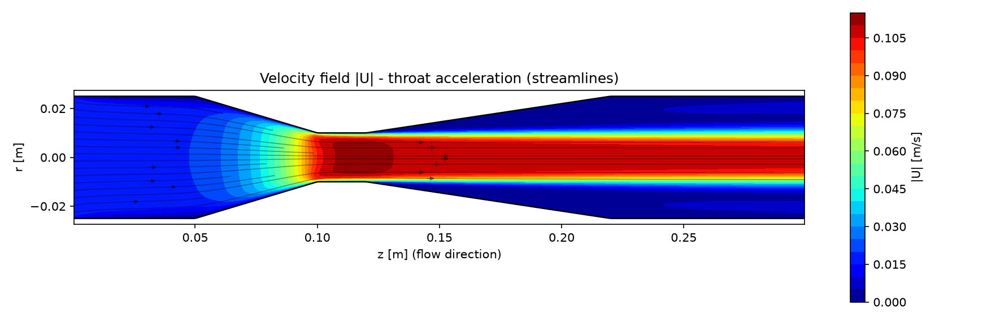
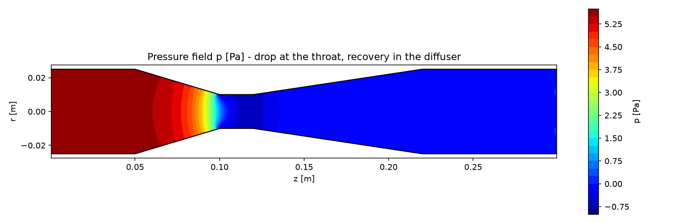
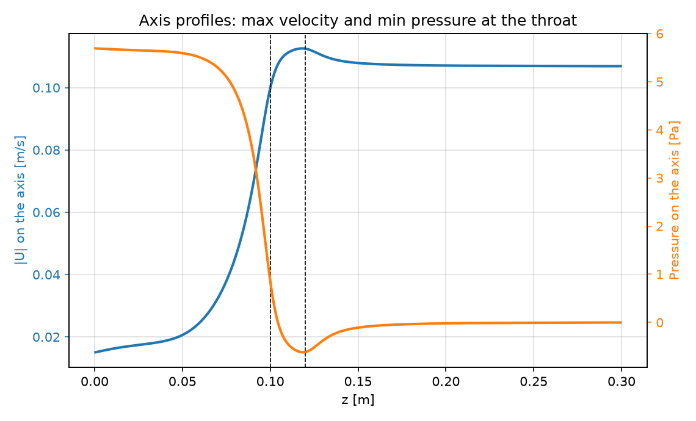
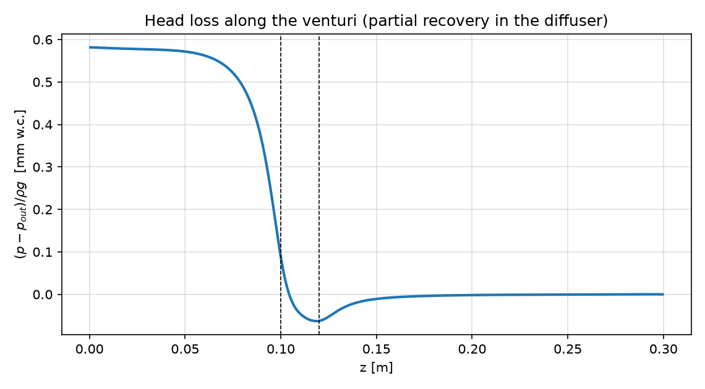

# CFD de Tubo Venturi — Navier-Stokes Axissimétrico em Python & MATLAB

*[Read in English](README.md)*

Simulação numérica do escoamento incompressível de água em um **tubo Venturi**, desenvolvida como parte de projeto de Iniciação Científica (PIBIC) na **UNESP — Engenharia Química**, dentro da linha de **modelagem matemática no controle de emissões atmosféricas (lavadores Venturi)**.

Dois solvers independentes, implementados **do zero** (sem pacotes de CFD), em **Python e MATLAB**:

| Solver | Método | Python | MATLAB |
|---|---|---|---|
| **Navier-Stokes** | Projeção (fractional-step) em grade deslocada MAC, axissimétrico (r, z) | [`ns_projection.py`](python/venturi_cfd/ns_projection.py) | [`Simulacao_Venturi_Eduardo_Mariola.m`](matlab/Simulacao_Venturi_Eduardo_Mariola.m) |
| **Escoamento potencial** | Volumes finitos (Python) / FEM via PDE Toolbox (MATLAB) + Bernoulli + Darcy-Weisbach | [`potential_flow.py`](python/venturi_cfd/potential_flow.py) | [`venturi_pde_toolbox.m`](matlab/venturi_pde_toolbox.m) |

> 📌 Pesquisa relacionada aceita para **apresentação oral** no *International Congress on Scientific Research (IKSAD Institute, 2026)* — "Integration of Chemical Engineering and Sustainability: Mathematical Modelling in Emission Control".

---

## 🎯 Visão geral

O código prevê o **campo de velocidade, o campo de pressão e a perda de carga** do escoamento laminar de água em um tubo convergente-garganta-divergente, e verifica cada resultado contra referências analíticas (continuidade, Bernoulli, número de Reynolds, coeficiente de descarga *C<sub>d</sub>* e coeficiente de perda *K*).

- **Domínio:** Engenharia Química / Ambiental (hidrodinâmica de lavadores Venturi)
- **Stack:** Python (NumPy · SciPy · Matplotlib) e MATLAB (linguagem base — o solver NS não requer toolboxes pagas)
- **Status:** ativo (2025–presente)

## 📐 Modelo matemático

**Solver Navier-Stokes** — equações de Navier-Stokes incompressíveis axissimétricas em coordenadas cilíndricas (z, r):

```
∂u/∂t + (u·∇)u = −(1/ρ)∇p + ν∇²u ,   ∇·u = 0
```

- **Discretização:** **grade MAC** deslocada (pressão nos centros, u_z e u_r nas faces); a parede r = R(z) é imposta por máscara de células fluidas.
- **Integração temporal:** preditor explícito (advecção upwind de 1ª ordem + difusão central axissimétrica) seguido de **projeção via equação de Poisson para a pressão**, que impõe continuidade em precisão de máquina (|∇·u|ₘₐₓ ≈ 10⁻¹⁴). Passo de tempo adaptativo (CFL), marcha até o estacionário.
- **Condições de contorno:** velocidade uniforme na entrada, saída em pressão, não-deslizamento na parede, simetria no eixo.
- O operador de Poisson axissimétrico é montado esparso e **fatorado (LU) uma única vez** — cada passo custa apenas uma substituição triangular.

**Solver de escoamento potencial** — para escoamento irrotacional, u = ∇φ e a conservação de massa vira:

```
∇·( r ∇φ ) = 0
```

resolvida por volumes finitos conservativos em Python (FEM / PDE Toolbox no MATLAB). A pressão sai de **Bernoulli**; a perda de carga irreversível é estimada por **Darcy-Weisbach** laminar (f = 64/Re) integrada ao longo do tubo.

**Verificação (malha de produção, água a 20 °C, v_in = 0,015 m/s):**

| Grandeza | Analítico | Simulado |
|---|---|---|
| Velocidade de entrada (continuidade) | 0,0150 m/s | 0,0150 m/s |
| Velocidade na garganta (continuidade) | 0,0938 m/s | ≈ 0,094–0,109 m/s (desenvolvimento do perfil) |
| Queda entrada→garganta (Bernoulli) | 4,27 Pa | 4,2–5,7 Pa (invíscido vs. viscoso) |
| Reynolds (entrada / garganta) | 747 / 1868 | regime laminar confirmado |
| Perda de carga líquida (NS) | — | ≈ 5–6 Pa, C_d ≈ 0,87 |

## 🗂️ Estrutura do repositório

```
.
├── python/
│   ├── venturi_cfd/          # pacote: geometria, solvers, gráficos, validação
│   │   ├── geometry.py       # perfil da parede R(z), propriedades do fluido
│   │   ├── ns_projection.py  # Navier-Stokes (projeção / MAC)
│   │   ├── potential_flow.py # escoamento potencial (volumes finitos)
│   │   ├── plots.py          # campos espelhados, perfis
│   │   └── validation.py     # verificação analítica (Re, Cd, K, Bernoulli)
│   └── examples/
│       ├── run_ns_case.py
│       └── run_potential_case.py
├── matlab/                   # implementações originais em MATLAB
├── results/
│   ├── python/               # figuras geradas pelos solvers Python
│   └── matlab/               # figuras geradas pelos solvers MATLAB
├── docs/                     # notas do modelo e referências
├── requirements.txt
└── README.md
```

## ▶️ Como executar

**Python** (≥ 3.10):

```bash
pip install -r requirements.txt
cd python/examples
python run_ns_case.py            # Navier-Stokes, malha de produção (~1 min)
python run_ns_case.py --quick    # malha grosseira, teste rápido (~5 s)
python run_potential_case.py     # escoamento potencial (~10 s)
```

**MATLAB** (R2019b ou superior):

```matlab
cd matlab
Simulacao_Venturi_Eduardo_Mariola        % Navier-Stokes (MATLAB base)
Simulacao_Venturi_Eduardo_Mariola(true)  % teste rápido em malha grosseira
venturi_pde_toolbox                      % escoamento potencial (requer PDE Toolbox)
```

As figuras são gravadas em PNG na pasta `results/`.

## 📊 Resultados

**Campo de velocidade — aceleração na garganta (linhas de corrente):**



**Campo de pressão — queda na garganta, recuperação parcial no difusor:**



**Perfis no eixo e perda de carga:**

| | |
|---|---|
|  |  |

## 📚 Referências

- Chorin, A. J. (1968). *Numerical solution of the Navier-Stokes equations*. Mathematics of Computation, 22, 745–762. (método da projeção)
- Harlow, F. H.; Welch, J. E. (1965). *Numerical calculation of time-dependent viscous incompressible flow of fluid with free surface*. Physics of Fluids, 8, 2182–2189. (grade MAC)
- Said Ali, A.; Sheikh Suleimany, J.; Ibrahim, R. (2023). *Numerical Modeling of the Flow around a Cylinder using FEATool Multiphysics*. Engineering, Technology & Applied Science Research, 13(4), 11290–11297. (referência metodológica)
- White, F. M. *Mecânica dos Fluidos*, McGraw-Hill. (medidores Venturi, Darcy-Weisbach, coeficiente de descarga)

## 👤 Autor

**Eduardo Mariola Shouga Mendes** — graduando em Engenharia Química, UNESP
[LinkedIn](https://www.linkedin.com/in/eduardo-m-456a91220/) · shougamariola@gmail.com

## ⚖️ Licença e nota acadêmica

Distribuído sob a [Licença MIT](LICENSE). Este repositório integra pesquisa de Iniciação Científica em andamento (PIBIC/UNESP); ao reutilizar o modelo ou os resultados, credite o autor e cite a apresentação no IKSAD 2026.
